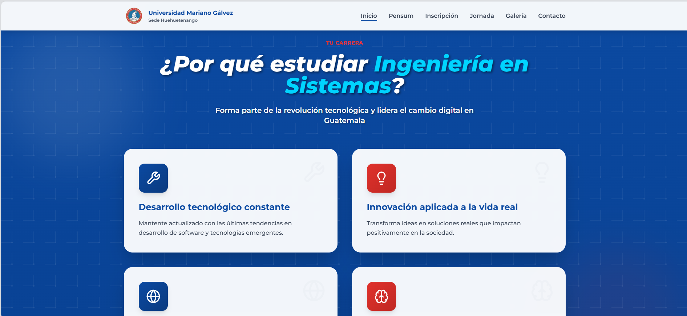
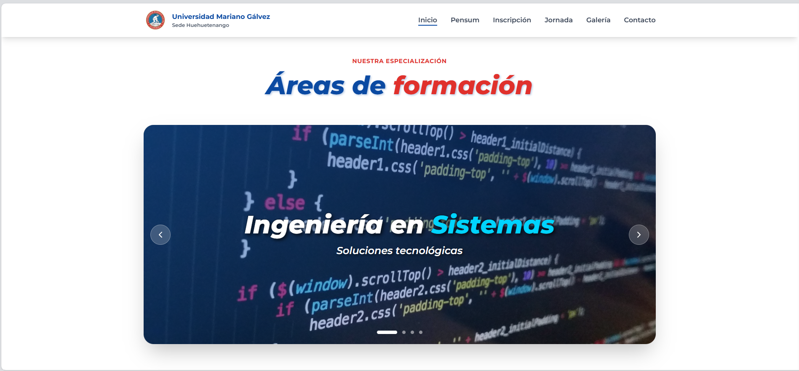
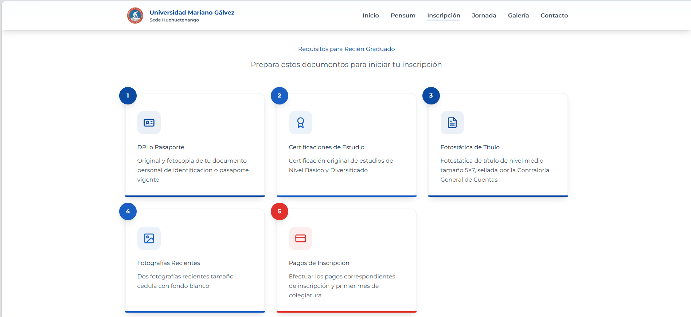
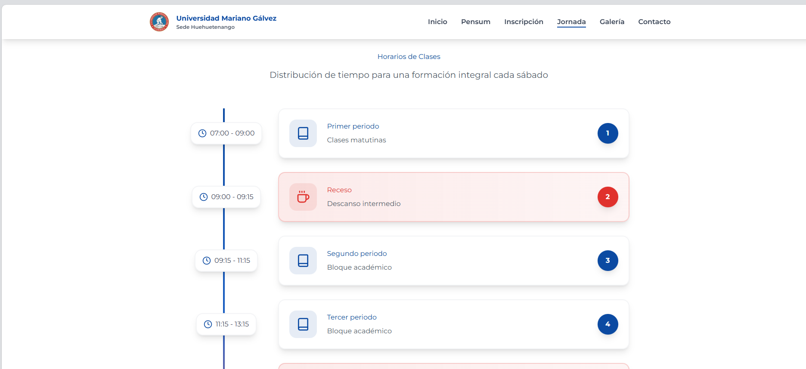
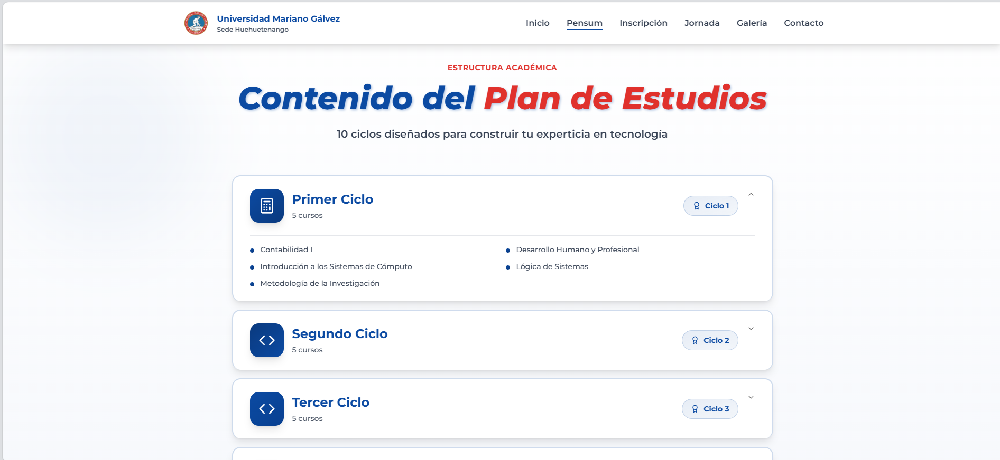

# Public Systems – Academic Frontend Web

Frontend web desarrollado como **sitio institucional/académico** para la carrera de Sistemas de la Universidad Mariano Gálvez (UMG).  
El proyecto fue diseñado como una landing moderna e informativa, con enfoque en experiencia de usuario, arquitectura de componentes y animaciones cuidadas.

Este repositorio busca demostrar **bases sólidas en frontend moderno**, más allá de un proyecto meramente académico.

---

## Stack tecnológico

- **React + TypeScript**
- **Vite**
- **Tailwind CSS**
- **Framer Motion**
- **ESLint / Prettier**
- **Docker + Nginx (SPA)**
- **Husky / lint-staged**

---

## Características técnicas destacadas

- Arquitectura basada en componentes reutilizables.
- Navegación centralizada para evitar prop drilling y manejar scroll de forma consistente.
- Animaciones fluidas y controladas con Framer Motion.
- Diseño responsive para desktop y dispositivos móviles.
- Separación clara entre lógica, presentación y estilos.
- Configuración de entorno y despliegue lista para producción básica.

---

## Archivos clave para revisión técnica

Si eres reclutador o desarrollador y deseas revisar piezas representativas del proyecto:

- `src/components/Navbar.tsx`  
  Navbar responsive con manejo de estado, animaciones y comportamiento según scroll.

- `src/components/ImageCarousel.tsx`  
  Carrusel con auto-play, controles manuales y animaciones suaves.

- `src/components/TechVision.tsx`  
  Sección visual con CTA, animaciones SVG e interacción con la navegación.

---

## Enfoque de diseño

El diseño prioriza:

- Claridad del mensaje institucional.
- Jerarquía visual.
- Microinteracciones que mejoran la experiencia sin sobrecargar la UI.
- Consistencia visual en todo el sitio.

---

## Contexto académico

Este proyecto fue desarrollado como parte de la carrera universitaria, cumpliendo un rol **institucional/académico**, pero con un enfoque intencional en buenas prácticas y estándares modernos de desarrollo frontend.

---

## Capturas del proyecto

Vista general de las principales secciones del sitio institucional.

<table>
  <tr>
    <td align="center">
      
       
      Inicio
    </td>
    <td align="center">
      
       
      Inicio – sección informativa
    </td>
    <td align="center">
      
       
      Proceso de inscripción
    </td>
  </tr>
  <tr>
    <td align="center">
      
       
      Jornadas académicas
    </td>
    <td align="center">
      
       
      Pensum
    </td>
    <td align="center">
      
       
      Contacto
    </td>
  </tr>
</table>

## Nota de privacidad

El código completo del proyecto se mantiene privado. Este showcase contiene archivos seleccionados y anotados con fines de evaluación técnica.

## Autor

Anderson Aguirre  
Desarrollador Junior Full Stack

## Contacto

- Email: andersonaguirre794@gmail.com
- Disponible para roles Frontend (remoto) junior/semisenior.
